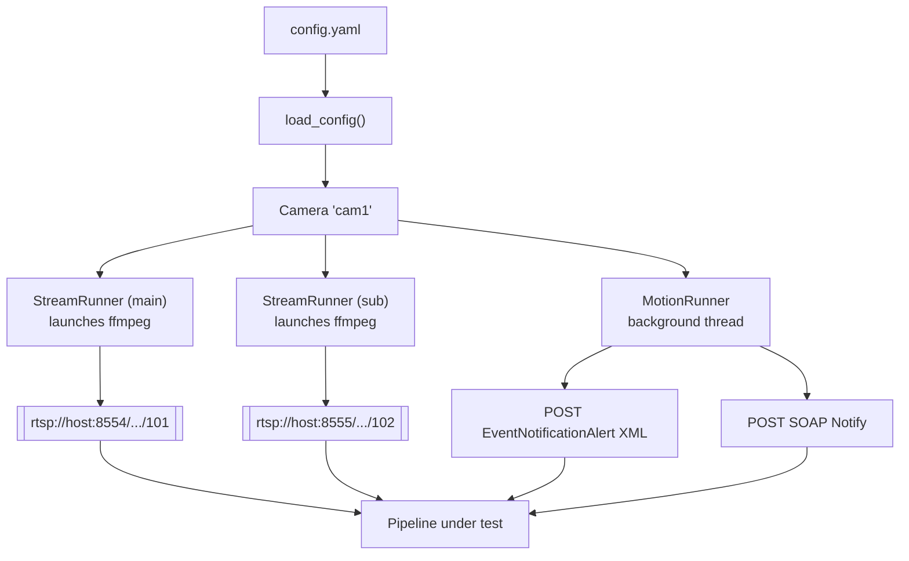

# camera-sim: design notes

This is the "why and how" behind `camera-sim`, for anyone picking this up
later without the context of when it was built. `README.md` covers how to
run it; this file covers why it works the way it does. Written for someone
with basic Python knowledge and general IP-camera knowledge — terms are
defined as they come up.

## Why this exists

cv-ppe's ingest stage (see root `SPEC.md`, "Pipeline" step 1) expects an RTSP
video feed per camera plus an optional motion trigger over ONVIF or a
webhook. Testing that stage against real cameras is slow and needs hardware
on hand. `camera-sim` is a test double: a small standalone program that
behaves like a set of real IP cameras closely enough that the pipeline can't
tell the difference, built from local video files instead of a live feed.

It has two responsibilities:

1. **Stream video** — loop local video files out over RTSP, using the same
   protocol and URL layout a real Hikvision camera uses.
2. **Fire motion alerts** — periodically POST a "motion detected" message to
   a configured address, in the two formats real cameras commonly use (a
   Hikvision-style HTTP push, and an ONVIF-style push).

It lives in `services/camera-sim/`, outside `src/ppe_monitor/`, as its own
installable package with its own tests. It is **not a pipeline stage** and
never gets imported by pipeline code — see root `CLAUDE.md`'s pipeline
rules for why that boundary matters (stages talk only through
`ppe_monitor/types.py`; a camera simulator isn't a stage, it's something the
pipeline connects *to*).

## Terms and tools, in plain language

| Term | What it means here |
| --- | --- |
| **RTSP** (Real Time Streaming Protocol) | The protocol nearly every IP camera uses to send out live video. A viewer connects to a URL like `rtsp://camera/path` and the camera streams frames to it. |
| **RTSP server / client** | The camera is the *server* (it waits for connections); the NVR, VMS, or our pipeline is the *client* (it connects in). This is a "pull" model — the viewer pulls video from the camera. |
| **Main stream / sub stream** | Most cameras output two video feeds at once: a high-resolution "main" stream for recording, and a lower-resolution "sub" stream for lightweight tasks like live preview or, in our case, running the detector cheaply. |
| **ffmpeg** | A free, extremely widely used command-line program for reading, converting, and streaming audio/video. We don't stream video ourselves — we ask `ffmpeg` to do it, the same way almost every video tool does. |
| **Motion detection push / webhook** | Instead of a viewer constantly asking "any motion?", the camera itself sends a message the instant it detects motion. A "webhook" is the generic term for this: a URL you give a device so it can call you. |
| **ISAPI** | Hikvision's own HTTP-based API for configuring and querying their cameras (settings, snapshots, event pushes). Not a public standard — it's Hikvision-specific, but common enough that many non-Hikvision NVR tools support it too. |
| **ONVIF** | An open industry standard (backed by Axis, Bosch, Sony, and others, and supported by most modern cameras including Hikvision) for camera discovery, streaming setup, and events, so NVR software doesn't need custom code per camera brand. |
| **SOAP** | An XML-based message format for talking to a web service, older and more verbose than the JSON APIs common today. ONVIF is built on SOAP. |
| **`multipart/mixed`** | An HTTP message format that bundles several pieces (for example, an XML description plus a JPEG image) into one request, each separated by a marker called a boundary. |
| **Python dataclass** | A Python class that mainly just holds a fixed set of named fields, with less boilerplate than writing `__init__` by hand. Used throughout `config.py`. |
| **Subprocess** | A separate program our Python code launches and manages, rather than a library imported into it. We launch `ffmpeg` as a subprocess. |

## Architecture at a glance

One YAML config file describes every simulated camera. The CLI reads it,
then starts one background thread per stream and per motion channel — all
cameras run concurrently, independent of each other.



Each `StreamRunner` manages one `ffmpeg` process that owns one RTSP
endpoint; each `MotionRunner` is a plain Python thread that sleeps, then
sends HTTP requests, on a loop. There's no shared server tying cameras
together — add a camera to the config and the CLI just starts more threads
for it.

## How RTSP works, and how we mimic it

RTSP (Real Time Streaming Protocol) is a control protocol for streaming
media. It doesn't carry video itself — it's a set of text commands
(`DESCRIBE`, `SETUP`, `PLAY`, `TEARDOWN`) a client sends to negotiate a
stream, similar in spirit to HTTP. Once `PLAY` succeeds, the actual
video/audio flows over a related protocol (RTP), and RTSP just keeps
controlling it (pause, seek, stop).

The key point: **a real IP camera is the RTSP server, not the sender.** It
sits there listening on port 554, and does nothing until a client (an NVR,
VLC, or our pipeline) connects and issues `PLAY`. This is a *pull* model —
the camera never initiates anything; it waits to be asked. Hikvision
cameras additionally follow a channel-numbering convention for the URL
path:

```
rtsp://<camera-ip>:554/Streaming/Channels/101   <- channel 1, main stream
rtsp://<camera-ip>:554/Streaming/Channels/102   <- channel 1, sub stream
```

(channel number × 100, +1 for main or +2 for sub.)

**Why we reproduce the pull model.** Since this is exactly what the real
hardware does, making `camera-sim` behave the same way means the pipeline
code needs zero special-casing for "simulated" vs. "real" cameras — it just
connects to a URL, like it always would.

**How we implement it without writing an RTSP server ourselves.** `ffmpeg`
already has one built in. Normally you'd run
`ffmpeg ... -f rtsp rtsp://some-server/path` to *push* a stream to an
existing server. But the flag `-rtsp_flags listen` flips it around: ffmpeg
itself opens the port and waits for a client to connect, exactly like a
camera does. `rtsp.py`'s `build_ffmpeg_args()` builds exactly that command
per camera stream:

```
ffmpeg -re -stream_loop -1 -f concat -safe 0 -i playlist.ffconcat \
       -c copy -f rtsp -rtsp_flags listen rtsp://0.0.0.0:8554/Streaming/Channels/101
```

- `-re` paces the file to play at real playback speed (without it, ffmpeg
  would blast the whole file through as fast as the disk allows).
- `-f concat -i playlist.ffconcat` reads an ffmpeg-specific playlist file
  listing the clips to play, in order.
- `-stream_loop -1` loops that playlist forever.
- `-c copy` re-uses the video file's existing compressed data unchanged
  (fast, no re-encoding) — used when no resolution change is requested.

A `mode: publish` option also exists per stream, which drops
`-rtsp_flags listen` and instead points at an external RTSP URL (for
example, a MediaMTX server you already run) — useful if your test setup
expects to be pushed to rather than pulled from, at the cost of being less
faithful to how a real camera behaves.

**Looping order.** `order: sequential` uses one ffmpeg process that loops
the same playlist forever — seamless, no reconnects. `order: random` can't
be looped inside a single ffmpeg invocation while still reshuffling each
pass, so instead: `ffmpeg` plays a shuffled list once, exits, and a small
Python supervisor loop (`StreamRunner.run_forever`) reshuffles and restarts
it — meaning a client connected to a `listen`-mode stream sees a brief
reconnect once per full pass through the clips. It's a deliberate
trade-off, not an oversight — see "Design decisions" below.

## How Hikvision's motion push works, and how we mimic it

Unlike video, a motion alert is naturally a *push*: something happened, and
the camera wants to tell someone right away, rather than waiting to be
asked. Hikvision's cameras support this through **ISAPI** (their own
HTTP-based configuration and event API), in a mode Hikvision calls
**"HTTP Listening"**:

1. You configure the camera (via `PUT /ISAPI/Event/notification/httpHosts/<id>`)
   with a target host, port, and URL path — essentially "call me here."
2. From then on, every time an event fires (motion starts, motion stops,
   tampering, etc.), the camera makes an HTTP `POST` request to that
   address, carrying an XML document called `EventNotificationAlert`.
3. If snapshot-on-event is turned on, the request instead uses
   `multipart/mixed` — the same XML plus a JPEG image, bundled into one
   HTTP body.

A simplified real `EventNotificationAlert` looks like this:

```xml
<EventNotificationAlert version="1.0" xmlns="http://www.hikvision.com/ver10/XMLSchema">
    <ipAddress>10.10.10.101</ipAddress>
    <channelID>1</channelID>
    <dateTime>2026-09-22T14:32:11+02:00</dateTime>
    <eventType>VMD</eventType>
    <eventState>active</eventState>
    <eventDescription>Motion Alarm</eventDescription>
</EventNotificationAlert>
```

`VMD` stands for Video Motion Detection; `eventState` flips between
`active` (motion started) and `inactive` (motion stopped) as two separate
messages.

**How `hikvision_motion.py` reproduces it.** `build_event_xml()` fills in
the same template with the configured device details and either the `1.0`
schema (richer — includes IP/MAC address and a detection-region list) or
the simplified `2.0` schema. `send_event()` then either POSTs that XML
directly, or — if a snapshot was requested — hand-builds a
`multipart/mixed` body with the XML as one part and a JPEG (grabbed from
the currently looping video via a one-frame `ffmpeg` capture in
`snapshot.py`) as the second part, separated by a boundary marker, matching
the real camera's format.

This is a **best-effort reproduction** based on Hikvision's published
ISAPI field names and third-party integration guides, not verified against
real hardware or Hikvision's own SDK — close enough to exercise the
pipeline's parsing code, not guaranteed byte-for-byte identical to what a
physical camera sends.

## How ONVIF events work, and how we mimic them

ONVIF is an open standard, not a Hikvision-specific one, and most modern IP
cameras (Hikvision included) support it as an alternative to their own
proprietary API. Its goal is to let NVR software work with any brand of
camera without brand-specific code. ONVIF is built on **SOAP**: requests
and responses are XML documents wrapped in a standard `<Envelope>`, sent
over ordinary HTTP.

ONVIF's event mechanism is a publish/subscribe system (formally
"WS-BaseNotification"):

1. A subscriber tells the camera "send events to this address."
2. Whenever a matching event happens, the camera sends a SOAP `Notify`
   message to that address, containing a **topic** (what kind of event) and
   a small set of key/value data.
3. Motion specifically uses the topic `tns1:VideoSource/MotionAlarm`, with a
   `State` value of `true` (motion started) or `false` (motion stopped).

A simplified real ONVIF motion notification:

```xml
<SOAP-ENV:Envelope xmlns:wsnt="http://docs.oasis-open.org/wsn/b-2" ...>
  <SOAP-ENV:Body>
    <wsnt:Notify>
      <wsnt:NotificationMessage>
        <wsnt:Topic>tns1:VideoSource/MotionAlarm</wsnt:Topic>
        <wsnt:Message>
          <tt:Message UtcTime="2026-09-22T12:00:00Z">
            <tt:Data><tt:SimpleItem Name="State" Value="true"/></tt:Data>
          </tt:Message>
        </wsnt:Message>
      </wsnt:NotificationMessage>
    </wsnt:Notify>
  </SOAP-ENV:Body>
</SOAP-ENV:Envelope>
```

**How `onvif_motion.py` reproduces it.** `build_notify_envelope()` fills
the same SOAP structure with the configured producer address and
video-source name, setting `State` to `"true"` or `"false"`.
`send_notify()` POSTs it with the ONVIF-standard content type
`application/soap+xml`.

One thing we deliberately left out: the real "subscribe first" handshake
(`CreatePullPointSubscription`/`Subscribe`) that sets up *where* a camera
should push to. `camera-sim` skips that negotiation and sends straight to
whatever `target_url` you put in the config — as if a subscription already
existed. That's enough to test how the pipeline *handles* an incoming
ONVIF event, which is the part that matters for this project; it doesn't
test subscribing to a camera.

## Code walkthrough

`services/camera-sim/src/camera_sim/` has eight small files. Each does one
job.

| File | Job |
| --- | --- |
| `config.py` | Reads the YAML file into typed Python objects, and rejects an invalid config immediately instead of failing confusingly later. |
| `playlist.py` | Finds video files in a folder and builds the ffmpeg-readable playlist. |
| `rtsp.py` | Builds the `ffmpeg` command line and supervises the process (restarts it if it crashes or finishes a random pass). |
| `snapshot.py` | Grabs a single JPEG frame from a clip, for motion snapshots. |
| `hikvision_motion.py` | Builds and sends the Hikvision-style XML motion message. |
| `onvif_motion.py` | Builds and sends the ONVIF-style SOAP motion message. |
| `motion.py` | Runs the motion-event schedule for one camera, calling into whichever of the two above are enabled. |
| `cli.py` | The `camera-sim run --config ...` command: loads the config and starts one thread per stream/motion-channel. |

**`config.py`.** Uses `@dataclass` to define the shape of the config —
e.g. `StreamConfig` has fields like `mode`, `bind_host`, `bind_port`. Each
dataclass has a `__post_init__` method that runs right after it's
constructed and checks for mistakes:

```python
def __post_init__(self) -> None:
    if self.mode == "publish" and not self.target_url:
        raise ValueError("stream mode 'publish' requires target_url")
```

This fails loudly at startup ("you forgot `target_url`") instead of
silently doing the wrong thing five minutes into a test run.

**`playlist.py`.** `list_clips()` lists video files in a folder, sorted by
name. `order_clips()` either keeps that order (`sequential`) or shuffles it
(`random`) using Python's `random` module. `write_concat_playlist()` writes
those file paths into the text format `ffmpeg`'s `concat` feature expects —
one `file '<path>'` line per clip — escaping any single quotes in filenames
the way ffmpeg requires.

**`rtsp.py`.** `build_ffmpeg_args()` is a pure function: given a playlist
and a stream's settings, it returns the list of command-line arguments to
run — nothing is launched yet, which makes it easy to unit-test (just check
the list of strings) without needing `ffmpeg` installed. `StreamRunner.run_forever()`
is what actually calls `subprocess.Popen(args)`, waits for it to exit, and
restarts it (reshuffling first, for random order), with a growing back-off
delay if it keeps crashing immediately.

**`snapshot.py`.** Runs `ffmpeg -frames:v 1 ... -f image2pipe -vcodec mjpeg -`
against a random clip and captures its output directly as bytes (no
temporary file needed) to use as the "snapshot" attached to a motion event.

**`hikvision_motion.py` / `onvif_motion.py`.** Each has a
`build_..._xml/envelope()` function (pure string templating — easy to test
by parsing the result back with Python's built-in `xml.etree.ElementTree`)
and a `send_...()` function that does the actual HTTP POST via the
`requests` library.

**`motion.py`.** `MotionRunner.run_forever()` is the scheduler: wait a
random interval, fire an `active` event on every enabled channel, wait
`active_duration_seconds`, fire `inactive`, repeat — until told to stop.
It's driven by a `threading.Event` (`stop_event`) rather than a
`while True`, so the CLI can cleanly shut every camera down together on
Ctrl+C.

**`cli.py`.** `main()` parses `--config`, then `run()` loads it, registers
a signal handler for Ctrl+C, and starts one `threading.Thread` per stream
and per motion channel, all as daemon threads sharing one `stop_event`.
Threads (not separate processes) are fine here because each thread mostly
just waits on `ffmpeg`/network I/O — Python's Global Interpreter Lock isn't
a bottleneck when nothing is doing heavy CPU work in Python itself.

## Design decisions

**A separate service, not part of `src/ppe_monitor/`.** The pipeline's own
rule is that its stages (ingest, track, helmet check, dedup) talk only
through shared types and never contain test-only code. A camera simulator
isn't a pipeline stage — it's a stand-in for hardware the pipeline connects
*to*. Keeping it in `services/camera-sim/`, as its own installable package
with its own tests, means it can be run, versioned, or even deployed
independently, and never accidentally gets imported by real pipeline code.

**Shelling out to `ffmpeg` instead of writing an RTSP server from
scratch.** RTSP plus real-time video muxing is a substantial protocol to
implement correctly (timing, codecs, packetization). `ffmpeg` already does
this, is free, and is the de facto standard tool for this exact job —
nearly every camera simulator or test tool in this space is a wrapper
around it rather than a reimplementation. We call it as an external
program (a "subprocess"), not a Python library, so `camera-sim` stays
simple Python that just builds command lines and manages processes.

**`listen` mode as the default, `publish` as an option.** Matching how a
real camera actually behaves (see "How RTSP works" above) means the
pipeline's ingest code, and its configuration, work unmodified against
`camera-sim`. `publish` is kept as an option because some test environments
already run a central media server and would rather have streams pushed to
it.

**Two motion channels, fired together.** The SPEC for this project
explicitly allows "ONVIF/webhook" as an alternative motion trigger to the
pipeline's own detector, without picking one. Since real hardware often
supports both simultaneously, `camera-sim` fires both by default
(configurable) so either code path in the pipeline can be exercised
without switching simulator configs.

**Sequential loops seamlessly, random reshuffles between passes.** This is
a genuine trade-off, not a workaround: true per-pass randomization needs
the clip order decided *after* the previous pass has been consumed, which
means restarting `ffmpeg`. Rather than hide that behind a fragile trick,
the code accepts a brief reconnect once per pass and documents it, so
nobody chasing a flaky test later mistakes it for a bug.

**Licensing note.** `ffmpeg` builds can be LGPL or GPL depending on how
they were compiled. Because `camera-sim` calls the system's `ffmpeg` binary
as a separate process rather than linking its code into ours, this is a
materially different (much lighter) licensing situation than bundling it —
but it's flagged in `docs/licenses.md` (repo root) for the same reason the
project already flags OpenCV's bundled FFmpeg: confirm it's acceptable
before this tool is used anywhere near a shipped product, since
`camera-sim` itself is dev/test tooling, not part of what ships to a site.

## Testing, and what's not covered

30 unit tests (`pytest -q`) cover config parsing and validation, clip
listing/ordering/escaping, the exact `ffmpeg` command line built for each
mode, and both XML/SOAP message builders (checked by parsing them back with
`xml.etree.ElementTree`). All of these are pure functions — given an input,
they return an output with no side effects — so the tests run in under half
a second with no `ffmpeg` binary and no network needed. HTTP sending is
tested by passing in a fake `post` function that just records what it was
called with, instead of a real network call.

What isn't covered, and is worth knowing before relying on this:

- **No live end-to-end test.** `ffmpeg` wasn't available in the development
  sandbox this was built in, so no test has actually opened a real RTSP
  connection or received a real HTTP motion POST. Try `camera-sim run`
  against a real RTSP client (VLC, ffplay, or the pipeline itself) before
  depending on it.
- **Not verified against real camera hardware.** The XML/SOAP formats are
  built from Hikvision's published field names and public ONVIF
  documentation, not captured from an actual device.
- **ONVIF subscription handshake isn't implemented** — events go straight
  to a configured URL, skipping the real `Subscribe` negotiation.
- **`random` order causes a brief RTSP reconnect** once per full pass
  through the clips, by design (see "Design decisions" above) — not a bug
  if you see it.
